# xhs-content-workflow

一个小红书内容生产与自动发布工作流：可以从本地草稿生成发布包，再自动调用 Gemini 生图和小红书 CLI 发布。Claude API 只是可选的自动写文案能力。

本项目不做自动登录、不读取 Cookie、不绕过验证码；发布动作通过本机已有的小红书自动化 CLI 执行。

## 目录

```text
xhs-content-workflow/
├── config/                # 图片提示词 Profile 配置
├── data/                  # 选题、笔记、数据复盘表
├── docs/                  # 账号定位、栏目、合规和风格文档
├── prompts/               # Claude 提示词模板
├── output/publish_packages/
├── output/published_images/   # 按 MM-DD/发布包名 保存每日生图
├── src/                   # 命令行脚本和核心模块
└── tests/                 # 单元测试
```

## 初始化

```bash
cd xhs-content-workflow
python3 -m venv .venv
source .venv/bin/activate
pip install -r requirements.txt
cp .env.example .env
```

如果要用 Claude API 自动生成文案，在 `.env` 中填写：

```env
ANTHROPIC_API_KEY=你的 Claude API Key
CLAUDE_MODEL=claude-sonnet-4-5
```

如果采用无 API 模式，可以不填 `ANTHROPIC_API_KEY`。

## 图片提示词 Profile

图片质量现在优先由本地模板控制，而不是完全交给 AI 自由发挥。默认配置文件在：

```text
config/image_prompt_profiles.json
```

配置结构包含三层：

1. `global_quality_rules`
   - 所有图片都会统一追加的质量约束，比如竖版比例、中文清晰、留白、不要水印。
2. `profiles`
   - 你自己维护的生图模板集合，每套模板包含：
   - `name`：模板名
   - `match`：按 `category`、`audience`、`angle`、`keywords` 命中
   - `cover_template`：封面 prompt 模板
   - `content_templates`：内容图 prompt 模板
   - `default_image_suggestions`：没有手填配图建议时的默认内容
3. `fallback_profile`
   - 当前选题没有命中任何模板时使用的兜底模板

当前内置了 4 套模板：

- `business_infographic`：投资、趋势、商业观察类
- `decision_checklist`：避坑、清单、教程、选购类
- `lifestyle_flatlay`：生活方式、通勤、家居类
- `beauty_comparison`：护肤、美妆、对比类

## 草稿写法

本地草稿现在支持两种方式：

### 方式一：完全手写 `image_prompts`

如果你已经把每张图的最终提示词写好了，系统会直接使用，不做覆盖。

### 方式二：只写 `image_profile` + `image_suggestions`

如果你希望由本地模板系统来拼出最终 prompt，可以只提供模板名和每张图的内容建议，例如：

```json
{
  "topic": "全球市值前五十的公司",
  "category": "投资",
  "audience": "理财",
  "angle": "社会趋势",
  "recommended_title": "市值前50藏着趋势",
  "body": "正文略",
  "hashtags": ["投资学习"],
  "image_profile": "business_infographic",
  "image_suggestions": [
    "封面图：全球市值前50与趋势感",
    "信息图：五大板块拆解",
    "清单图：普通人最该看的三个问题",
    "风险提醒图：这不是荐股清单"
  ]
}
```

如果你不写 `image_profile`，系统会根据 `category`、`audience`、`angle` 自动匹配最合适的模板；如果没命中，就走 `fallback_profile`。

## 使用流程

## 流程图

README 内先放一版可直接阅读的流程图；可编辑的 draw.io 文件在 `docs/xhs-auto-publish-flow.drawio`。

```mermaid
flowchart LR
    topicInput["选题输入<br/>data/topics.csv 或 drafts/*.json"]
    contentBuild["内容生成<br/>Claude 生成内容 或 本地草稿"]
    profileSelect["图片模板选择<br/>image_profile / category / audience / angle"]
    promptRender["图片提示词生成<br/>config/image_prompt_profiles.json"]
    publishPackage["发布包输出<br/>output/publish_packages/*.json"]
    reviewGate{"人工审核<br/>输入 publish 才继续"}
    geminiImage["Gemini 自动生图<br/>gemini_automation.py"]
    xhsPublish["小红书自动发布<br/>cli.py publish"]
    publishStatus["状态回写<br/>publish_status / note_url"]
    metrics["数据复盘<br/>data/metrics.csv / analyze_metrics.py"]
    skipPublish["拒绝审核<br/>保持 draft"]

    topicInput --> contentBuild
    contentBuild --> profileSelect
    profileSelect --> promptRender
    promptRender --> publishPackage
    publishPackage --> reviewGate
    reviewGate -->|通过| geminiImage
    geminiImage --> xhsPublish
    xhsPublish --> publishStatus
    publishStatus --> metrics
    reviewGate -->|拒绝| skipPublish
```



### 方案一：无 API 模式

1. 复制并编辑本地草稿：

```bash
cp drafts/example_draft.json drafts/my_post.json
```

2. 从草稿生成标准发布包：

```bash
PYTHONPATH=src python3 src/create_package.py drafts/my_post.json
```

如果草稿里没有手写 `image_prompts`，命令会根据 `image_profile` 或选题元信息自动生成最终图片提示词，并写入发布包 JSON。

3. 审核内容后自动生成图片并发布：

```bash
PYTHONPATH=src python3 src/auto_publish.py --package output/publish_packages/manual-001_新手如何选择第一台咖啡机.json
```

命令会展示标题、正文、话题和合规风险。审核通过请输入 `publish`，之后系统会调用 Gemini 自动生成图片，并调用小红书 CLI 一步发布。

### 方案二：Claude API 自动生成文案

1. 在 `data/topics.csv` 维护选题，状态为 `draft` 的行会被生成。
2. 编辑 `docs/brand_guide.md`、`docs/content_pillars.md`、`docs/compliance_rules.md`。
3. 生成并发布：

```bash
PYTHONPATH=src python3 src/auto_publish.py
```

Claude API 模式现在会优先输出 `image_profile` 和 `image_suggestions`，再由本地模板系统统一生成最终 `image_prompts`，这样更容易保持图片风格稳定。

也可以发布一个已有发布包：

```bash
PYTHONPATH=src python3 src/auto_publish.py --package output/publish_packages/001_新手如何选择第一台咖啡机.json
```

如果要跳过审核提示：

```bash
PYTHONPATH=src python3 src/auto_publish.py --yes
```

## 自动发布前置条件

1. Chrome、bridge server、Gemini 登录状态可用。
2. 小红书账号已登录，且 `/Users/lilin/.claude/skills/xiaohongshu-skills/scripts/cli.py check-login` 通过。
3. Gemini 图片生成脚本可用：`/Users/lilin/.claude/skills/lilin-rednote/scripts/gemini_automation.py`。
4. 发布频率要控制，避免短时间批量发布。
5. 只有使用方案二时才需要 `ANTHROPIC_API_KEY`。

## 数据复盘

发布后维护 `data/metrics.csv`，生成复盘摘要：

```bash
PYTHONPATH=src python3 src/analyze_metrics.py
```

需要 Claude 深度复盘时：

```bash
PYTHONPATH=src python3 src/analyze_metrics.py --package output/publish_packages/001_新手如何选择第一台咖啡机.md
```

## 测试

```bash
PYTHONPATH=src python3 -m unittest discover -s tests -v
```
